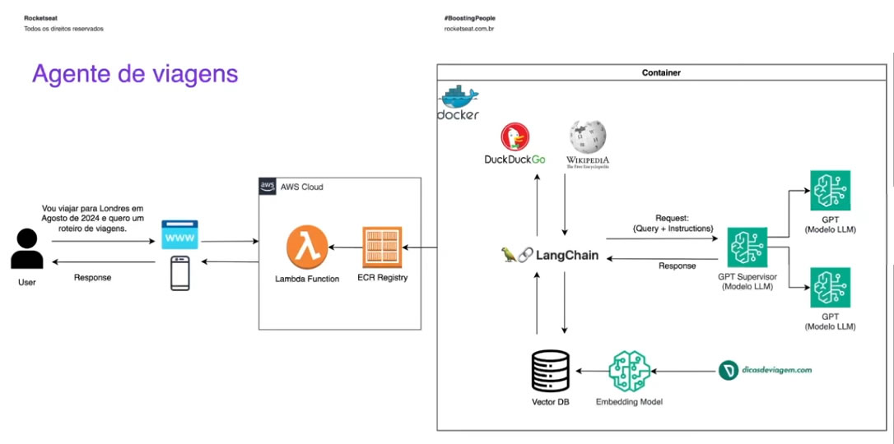

# NEXT LEVEL WEEK - Rocketseat
## Inteligência artificial

Neste repositório se encontra o código mostrado em aula. Nesta edião da Next Level Week, realizada em julho de 2024, foi feito uma API utilizando Python, Langchain e ChatGPT. Também foi mostrado o deploy na  Amazon AWS

O código original da aula está dentro da pasta NLW. 

Na raiz desde repositório tem o código modificado, utilizando o GeminiAI. A API foi feita utilizando o LangCorn. 



## Testar

Para testar execute o seguinte comando:

```
uvicorn app.main:app --reload 
```

Para ver a documentação da API, acessar o seguinte endereço:
http://127.0.0.1:8000/docs


Para testar, utilize o seguinte endpoint:
**/conversation (POST)**

Fazer a requisição pelo Postman utilizando o header Content-Type como "application/json". O body da requisição deve ser "raw"

```
{
  "question": "Vou viajar para Londres em setembro de 2024. Quero que faça para um roteiro de viagem para mim com eventos que irão ocorrer na data da viagem e com o preço de passagem de São Paulo para Londres."
}
```

## Docker

Os testes foram feitos no Windows 10, foi necessário primeiro instalar o Docker Desktop e abrir ele antes de executar o comando. A imagem que vai ser criada pelo comando a seguir vai ficar disponível no Docker Desktop.

```
docker build -t api_nlw .
```

Para executar a imagem:

```
docker run -p 8000:8000 api_nlw
```
